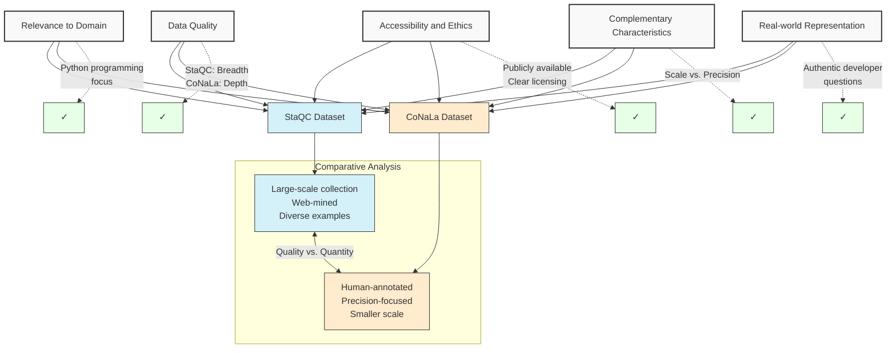

```mermaid
flowchart TD
    classDef criteria fill:#f9f9f9,stroke:#333,stroke-width:2px
    classDef staqc fill:#d4f1f9,stroke:#333,stroke-width:1px
    classDef conala fill:#ffebcd,stroke:#333,stroke-width:1px
    classDef comparison fill:#e6ffe6,stroke:#333,stroke-width:1px
    
    %% Main criteria nodes
    C1[Relevance to Domain]:::criteria
    C2[Data Quality]:::criteria
    C3[Accessibility and Ethics]:::criteria
    C4[Complementary Characteristics]:::criteria
    C5[Real-world Representation]:::criteria
    
    %% Dataset nodes
    StaQC[StaQC Dataset]:::staqc
    CoNaLa[CoNaLa Dataset]:::conala
    
    %% StaQC characteristics
    S1[Large-scale collection\nWeb-mined\nDiverse examples]:::staqc
    
    %% CoNaLa characteristics
    C1a[Human-annotated\nPrecision-focused\nSmaller scale]:::conala
    
    %% Connections from criteria to datasets
    C1 --> StaQC & CoNaLa
    C2 --> StaQC & CoNaLa
    C3 --> StaQC & CoNaLa
    C4 --> StaQC & CoNaLa
    C5 --> StaQC & CoNaLa
    
    %% Dataset specific implementations
    StaQC --> S1
    CoNaLa --> C1a
    
    %% Comparison box
    subgraph Comparison[Comparative Analysis]
        S1 <--> |Quality vs. Quantity|C1a
    end
    
    %% Fulfillment descriptions
    C1 -.-> |Python programming\nfocus|Fulfillment1[✓]
    C2 -.-> |StaQC: Breadth\nCoNaLa: Depth|Fulfillment2[✓]
    C3 -.-> |Publicly available\nClear licensing|Fulfillment3[✓]
    C4 -.-> |Scale vs. Precision|Fulfillment4[✓]
    C5 -.-> |Authentic developer\nquestions|Fulfillment5[✓]
    
    class Fulfillment1,Fulfillment2,Fulfillment3,Fulfillment4,Fulfillment5 comparison
```
