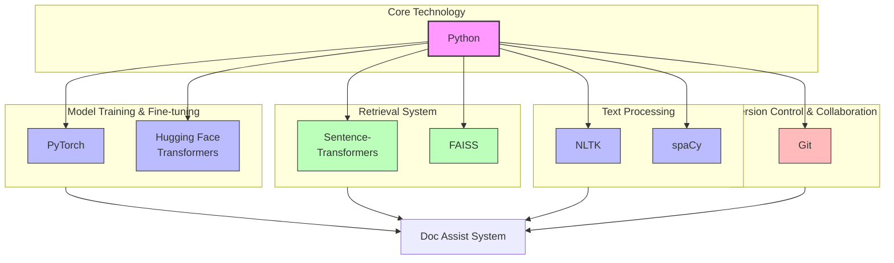

```mermaid
flowchart TD
    classDef core fill:#f9f,stroke:#333,stroke-width:2px
    classDef nlp fill:#bbf,stroke:#333,stroke-width:1px
    classDef retrieval fill:#bfb,stroke:#333,stroke-width:1px
    classDef infra fill:#fbb,stroke:#333,stroke-width:1px
    
    Python[Python] --> PyTorch[PyTorch]
    Python --> HF[Hugging Face\nTransformers]
    Python --> NLTK[NLTK]
    Python --> spaCy[spaCy]
    Python --> ST[Sentence-\nTransformers]
    Python --> FAISS[FAISS]
    
    subgraph Core["Core Technology"]
        Python
    end
    
    subgraph ML["Model Training & Fine-tuning"]
        PyTorch
        HF
    end
    
    subgraph Retrieval["Retrieval System"]
        ST
        FAISS
    end
    
    subgraph TextProcessing["Text Processing"]
        NLTK
        spaCy
    end
    
    subgraph VersionControl["Version Control & Collaboration"]
        Git[Git]
    end
    
    Python --> Git
    
    ML --> DocAssist[Doc Assist System]
    Retrieval --> DocAssist
    TextProcessing --> DocAssist
    VersionControl --> DocAssist
    
    class Python core
    class PyTorch,HF nlp
    class ST,FAISS retrieval
    class NLTK,spaCy nlp
    class Git infra
```
