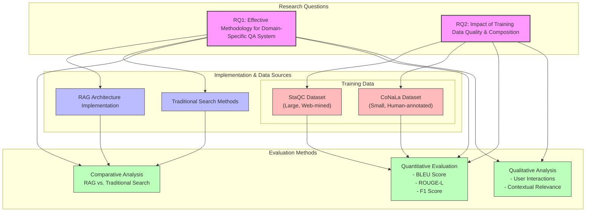

```mermaid
flowchart TD
    subgraph "Research Questions"
        RQ1["RQ1: Effective Methodology for Domain-Specific QA System"]
        RQ2["RQ2: Impact of Training Data Quality & Composition"]
    end

    subgraph "Implementation & Data Sources"
        RAG["RAG Architecture Implementation"]
        TRAD["Traditional Search Methods"]
        
        subgraph "Training Data"
            STAQC["StaQC Dataset<br>(Large, Web-mined)"]
            CONALA["CoNaLa Dataset<br>(Small, Human-annotated)"]
        end
    end

    subgraph "Evaluation Methods"
        QUANT["Quantitative Evaluation<br>- BLEU Score<br>- ROUGE-L<br>- F1 Score"]
        QUAL["Qualitative Analysis<br>- User Interactions<br>- Contextual Relevance"]
        COMP["Comparative Analysis<br>RAG vs. Traditional Search"]
    end

    RQ1 --> RAG
    RQ1 --> TRAD
    RQ1 --> COMP
    RQ1 --> QUANT
    RQ1 --> QUAL
    
    RQ2 --> STAQC
    RQ2 --> CONALA
    RQ2 --> QUANT
    RQ2 --> QUAL
    
    STAQC --> QUANT
    CONALA --> QUANT
    RAG --> COMP
    TRAD --> COMP
    
    classDef questions fill:#f9f,stroke:#333,stroke-width:2px
    classDef implementation fill:#bbf,stroke:#333,stroke-width:1px
    classDef evaluation fill:#bfb,stroke:#333,stroke-width:1px
    classDef data fill:#fbb,stroke:#333,stroke-width:1px
    
    class RQ1,RQ2 questions
    class RAG,TRAD implementation
    class QUANT,QUAL,COMP evaluation
    class STAQC,CONALA data
```
