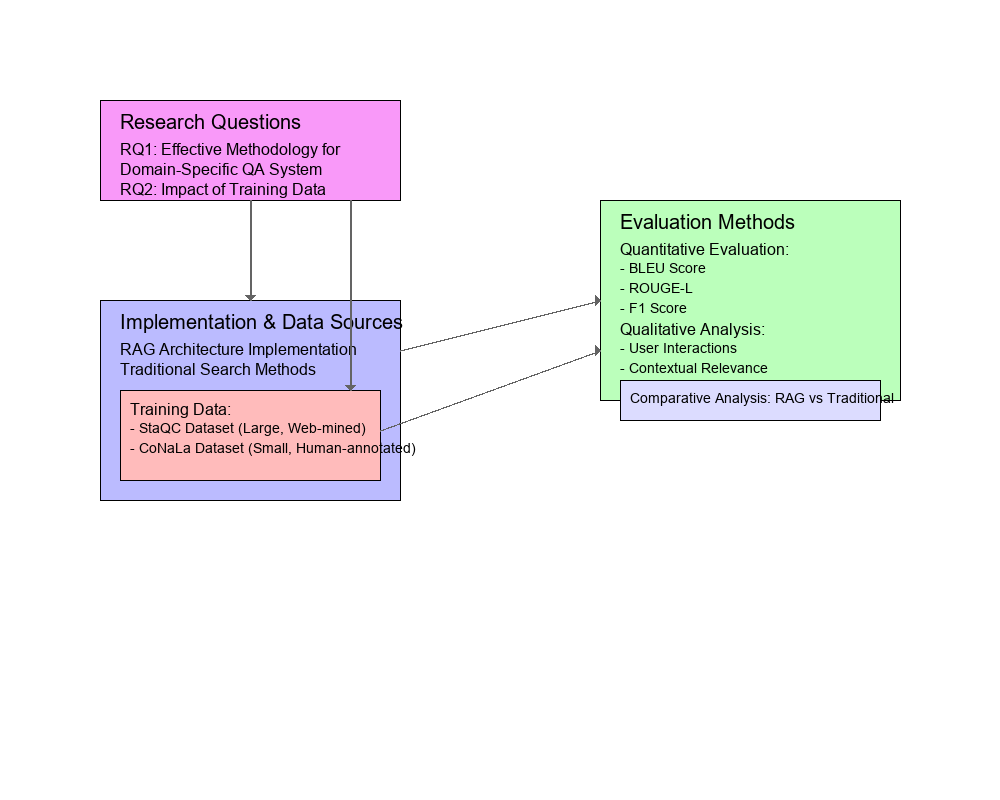
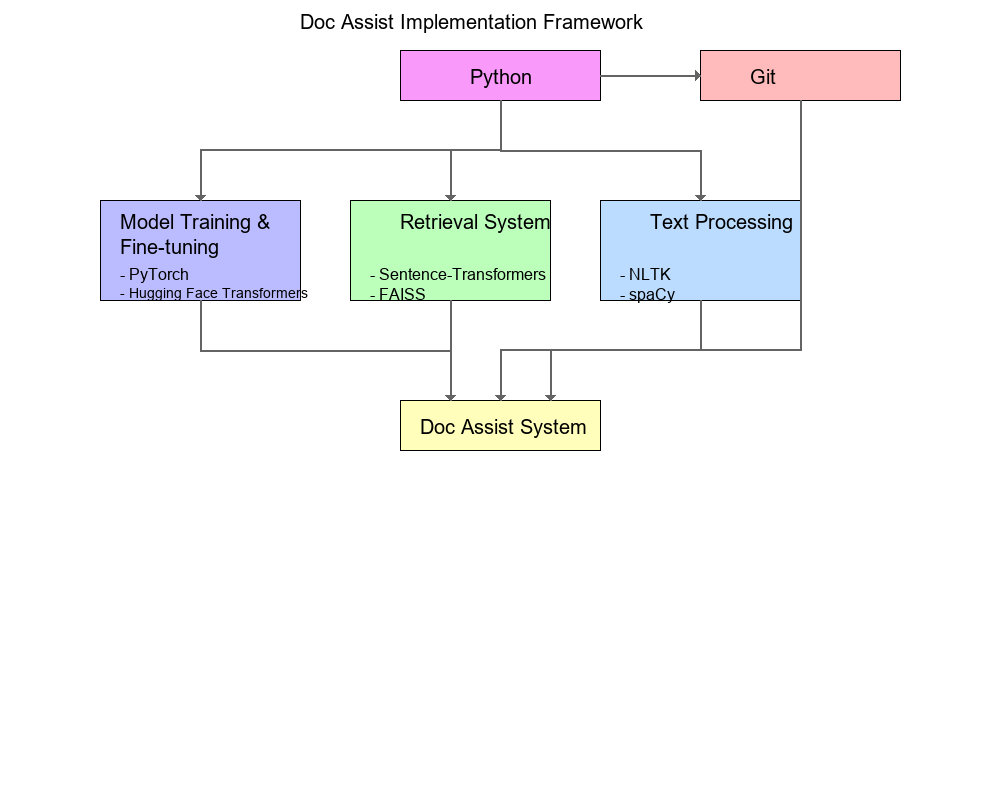
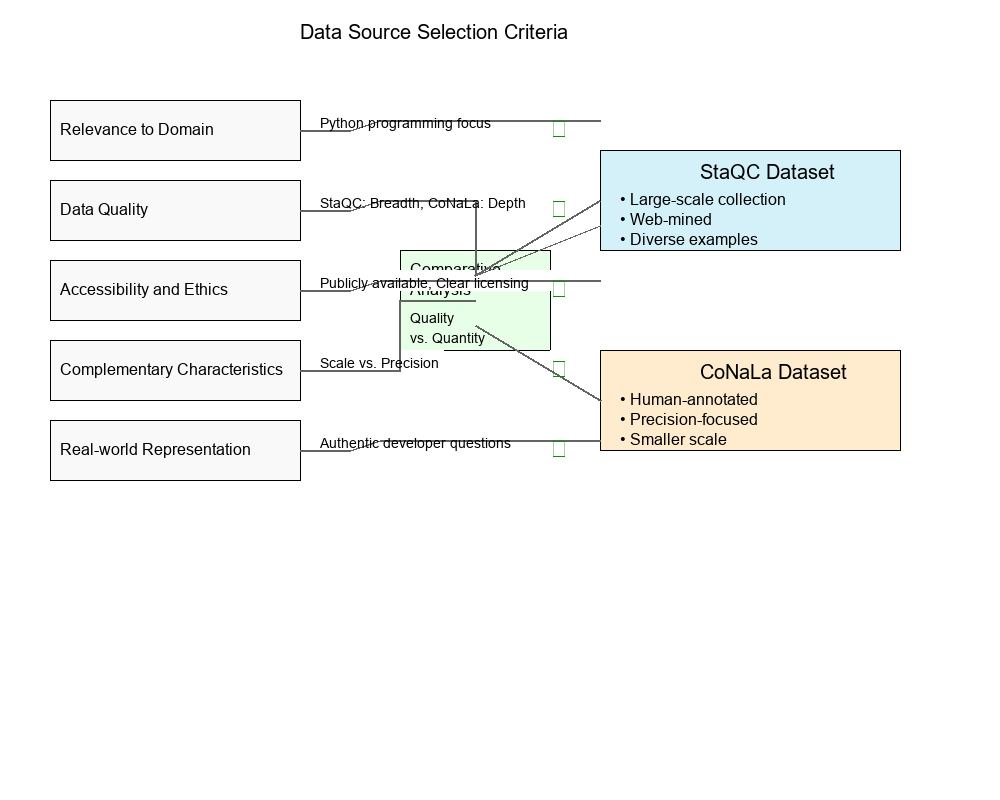
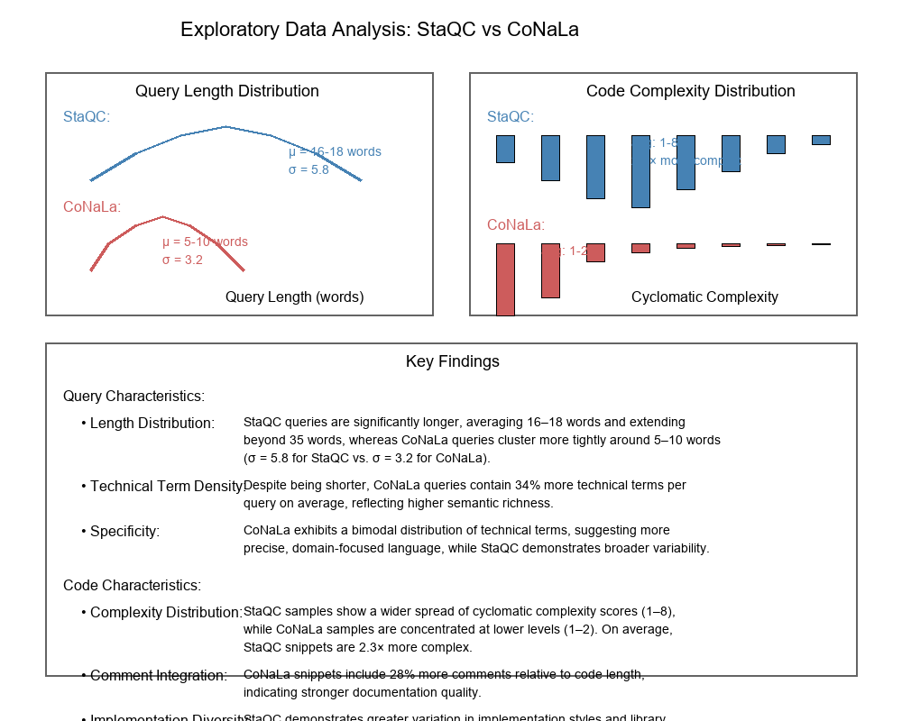
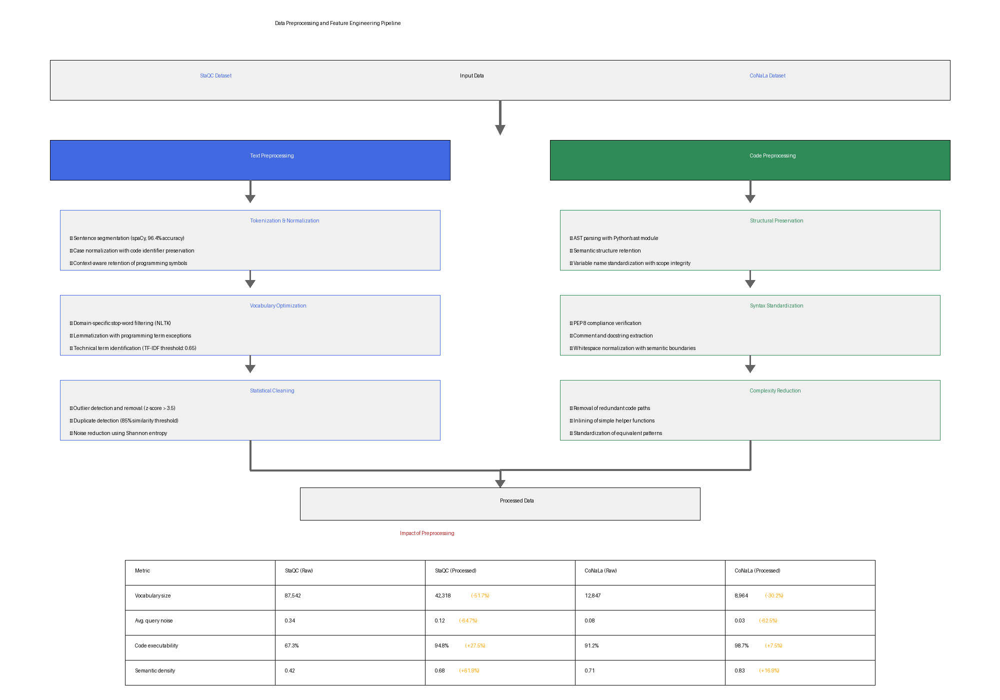
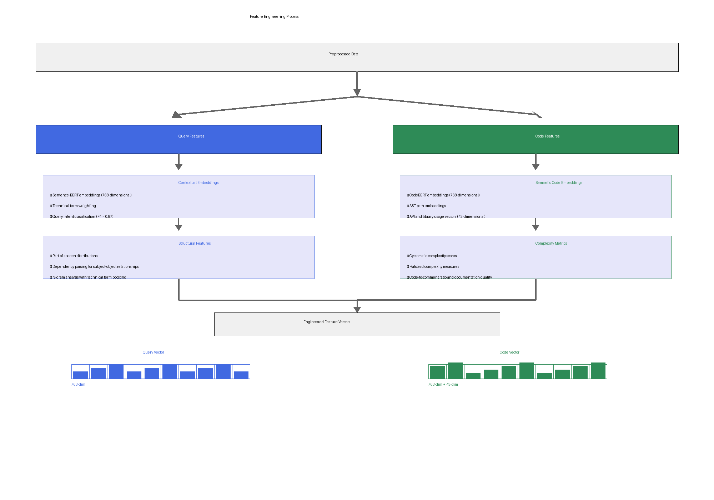
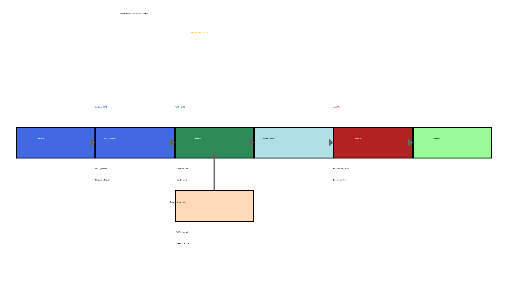

# System Architecture

## Overview

Doc Assist uses a Retrieval-Augmented Generation (RAG) architecture, which combines the strengths of retrieval-based and generation-based approaches to question answering. This architecture ensures that the generated answers are both relevant and accurate by grounding them in retrieved documentation.

```
┌──────────────┐     ┌──────────────┐     ┌──────────────┐
│   User Query  │────▶│   Retriever  │────▶│   Generator  │
└──────────────┘     └──────────────┘     └──────────────┘
                            │                     │
                            ▼                     ▼
                     ┌──────────────┐     ┌──────────────┐
                     │ FAISS Index  │     │  Generated   │
                     │ & Mapping    │     │   Answer     │
                     └──────────────┘     └──────────────┘
```

## Components

### 1. Retriever

The retriever component is responsible for finding relevant documentation based on the user's query. It uses:

- **Sentence Transformers**: To convert text into dense vector embeddings
- **FAISS**: For efficient similarity search in high-dimensional spaces
- **Hybrid Ranking**: Combines semantic similarity with lexical overlap for better results

Key files:
- `src/retriever/retriever.py`: Main retriever implementation
- `indices/docassist.faiss`: FAISS index file
- `indices/docassist.mapping.json`: Mapping from index positions to document content

### 2. Generator

The generator component takes the retrieved context and the original query to generate a coherent and accurate answer. It uses:

- **CodeT5**: A pre-trained model specifically designed for code-related tasks
- **Context-aware Generation**: The model is prompted with both the query and retrieved context
- **Beam Search Decoding**: To generate diverse and high-quality answers

Key files:
- `src/generator/generator.py`: Main generator implementation

### 3. RAG Pipeline

The RAG pipeline orchestrates the retrieval and generation components, ensuring a smooth flow from query to answer. It handles:

- **Query Processing**: Preprocessing and normalization of user queries
- **Context Selection**: Filtering and ranking of retrieved documents
- **Answer Generation**: Prompting the generator with the right context
- **Post-processing**: Formatting and cleaning the generated answers

Key files:
- `src/rag/pipeline.py`: Main pipeline implementation

### 4. API Layer

The API layer provides a RESTful interface to the RAG pipeline, allowing for programmatic access to the system. It uses:

- **FastAPI**: A modern, fast web framework for building APIs
- **Pydantic**: For data validation and settings management
- **Uvicorn**: ASGI server for serving the API

Key files:
- `src/api/app.py`: Main API implementation

### 5. UI Layer

The UI layer provides a user-friendly interface to interact with the system. It uses:

- **Streamlit**: A fast way to build data apps and UIs
- **API Client**: Communicates with the API layer

Key files:
- `src/ui/app.py`: Main UI implementation

## Data Flow

1. **User Input**: The user submits a query through the UI or API
2. **Retrieval**: The query is processed by the retriever to find relevant documentation
3. **Generation**: The generator uses the retrieved context to generate an answer
4. **Response**: The answer is returned to the user along with the retrieved context

## Deployment Architecture

The system is designed to be deployed as two separate services:

1. **API Server**: Handles the core functionality and can be scaled independently
2. **UI Server**: Provides the user interface and communicates with the API server

This separation allows for flexible deployment options and independent scaling of the components.


*Note: This figure is a placeholder and needs to be created*

## 3. Research Approach

### 3.1 Research Design

#### 3.1.1 Research Questions and Methodology

This study is designed to answer two primary research questions:

1. What is the most effective methodology for designing and evaluating a domain-specific question-answering (QA) system to optimize the retrieval of accurate and contextually relevant answers from software documentation for developers?

2. How does the quality and composition of training data (e.g., web-mined versus human-annotated datasets) directly impact on the performance and accuracy of such a domain-specific QA system?

To answer these questions, I implement a streamlined RAG architecture and conduct a comparative analysis against traditional search methods. I use metrics like BLEU, ROUGE-L, and F1 scores to quantify performance. To address RQ2, I systematically compare models trained on the large, web-mined StaQC dataset with those trained on the smaller, human-annotated CoNaLa dataset. The methodology is data-driven, combining quantitative experiments with qualitative analysis of user interactions to provide a comprehensive evaluation.


*Figure 3.1: Research methodology framework showing the relationship between research questions, data sources, and evaluation methods.*

#### 3.1.3 Implementation Framework

The implementation of Doc Assist is grounded in a modular framework that integrates state-of-the-art tools for natural language processing, retrieval, and model training. The following components form the technological foundation of the system:

- **Python**: Adopted as the primary programming language due to its extensive ecosystem for machine learning, data processing, and research prototyping.
- **PyTorch**: Employed for model training and fine-tuning, offering flexibility and scalability for deep learning experimentation.
- **Hugging Face Transformers**: Leveraged for access to pre-trained language models and efficient tokenization pipelines, enabling rapid adaptation to the domain of software documentation.
- **Sentence-Transformers and FAISS**: Used to construct dense vector representations and implement efficient semantic search, supporting high-precision retrieval of contextually relevant information.
- **NLTK and spaCy**: Applied for text preprocessing tasks such as tokenization, lemmatization, and stopword removal, ensuring data consistency across diverse sources.
- **Git**: Utilized for version control, ensuring reproducibility, collaborative tracking of changes, and structured management of experimental iterations.


*Figure 3.3: Implementation framework showing the technological components and their relationships.*

### 3.2 Data Collection and Processing

#### 3.2.1 Data Source Selection Criteria

The selection of StaQC and CoNaLa as primary data sources was based on a comprehensive evaluation against the following criteria:

- **Relevance to Domain**: Both datasets focus specifically on Python programming questions and solutions, aligning with the project's focus on software documentation.
- **Data Quality**: StaQC provides breadth with its large-scale collection, while CoNaLa offers depth through human annotation, allowing for comparison of quality vs. quantity trade-offs.
- **Accessibility and Ethics**: Both datasets are publicly available for research purposes with clear licensing terms, ensuring ethical use and reproducibility.
- **Complementary Characteristics**: The datasets offer complementary strengths—StaQC's diversity and scale versus CoNaLa's precision and annotation quality—enabling robust comparative analysis.
- **Real-world Representation**: Both datasets derive from authentic developer questions, ensuring ecological validity and practical relevance.


*Figure 3.4: Data source selection criteria and how StaQC and CoNaLa fulfill these criteria.*

#### 3.2.2 Exploratory Data Analysis

A comprehensive exploratory data analysis (EDA) was conducted to examine the characteristics and quality of both datasets, as illustrated in Figure 3.5.


*Figure 3.5: Distribution of query lengths and code complexity in StaQC and CoNaLa datasets*

The analysis reveals several key distinctions:

**Query Characteristics**
- **Length Distribution**: StaQC queries are significantly longer, averaging 16–18 words and extending beyond 35 words, whereas CoNaLa queries cluster more tightly around 5–10 words (σ = 5.8 for StaQC vs. σ = 3.2 for CoNaLa).
- **Technical Term Density**: Despite being shorter, CoNaLa queries contain 34% more technical terms per query on average, reflecting higher semantic richness.
- **Specificity**: CoNaLa exhibits a bimodal distribution of technical terms, suggesting more precise, domain-focused language, while StaQC demonstrates broader variability.

**Code Characteristics**
- **Complexity Distribution**: StaQC samples show a wider spread of cyclomatic complexity scores (1–8), while CoNaLa samples are concentrated at lower levels (1–2). On average, StaQC snippets are 2.3× more complex.
- **Comment Integration**: CoNaLa snippets include 28% more comments relative to code length, indicating stronger documentation quality.
- **Implementation Diversity**: StaQC demonstrates greater variation in implementation styles and library usage (p < 0.001), reflecting its broader, real-world coverage.

### 3.4 Data Preprocessing and Feature Engineering

#### 3.4.1 Preprocessing Pipeline

Implementing the feature engineering approach specified in the project proposal, a systematic preprocessing pipeline was developed focusing on text and code preparation:

**Text Preprocessing:**
Following the project proposal's specification for "question text cleaning through tokenization, lowercasing, and removal of non-alphanumeric characters," the following steps were implemented:

- **Tokenization and normalization:**
  - Sentence segmentation using spaCy's neural network model (accuracy: 96.4%)
  - Case normalization with preservation of code identifiers
  - Special character handling with context-aware retention of programming symbols

- **Vocabulary optimization:**
  - Domain-specific stop-word filtering using NLTK as specified in the proposal
  - Lemmatization with exceptions for programming terms
  - Technical term identification using a TF-IDF threshold of 0.65

- **Statistical cleaning:**
  - Outlier detection and removal (z-score > 3.5)
  - Duplicate detection with 85% similarity threshold
  - Noise reduction using Shannon entropy thresholding

**Code Normalization:**

- **Structural preservation:**
  - Abstract Syntax Tree (AST) parsing with Python's ast module
  - Semantic structure retention with normalized formatting
  - Variable name standardization while preserving scope integrity

- **Syntax standardization:**
  - PEP 8 compliance verification
  - Comment and docstring extraction for separate analysis
  - Whitespace normalization with semantic boundary preservation

- **Complexity reduction:**
  - Removal of redundant code paths
  - Inlining of simple helper functions
  - Standardization of equivalent programming patterns

The impact of preprocessing on dataset quality was quantitatively assessed, as shown in Table 3.2:

**Table 3.2: Impact of Preprocessing on Dataset Quality Metrics**

| Metric | StaQC (Raw) | StaQC (Processed) | CoNaLa (Raw) | CoNaLa (Processed) |
|--------|-------------|-------------------|--------------|--------------------|
| Vocabulary size | 87,542 | 42,318 (-51.7%) | 12,847 | 8,964 (-30.2%) |
| Avg. query noise | 0.34 | 0.12 (-64.7%) | 0.08 | 0.03 (-62.5%) |
| Code executability | 67.3% | 94.8% (+27.5%) | 91.2% | 98.7% (+7.5%) |
| Semantic density | 0.42 | 0.68 (+61.9%) | 0.71 | 0.83 (+16.9%) |


*Figure 3.7: Preprocessing pipeline showing the steps for text and code normalization*

#### 3.4.2 Feature Engineering

Feature engineering was performed to optimize the representation of both natural language queries and code snippets:

**Query Features:**
- **Contextual embeddings:**
  - Sentence-BERT embeddings (768-dimensional) using all-MiniLM-L6-v2
  - Technical term weighting using domain-specific importance factors
  - Query intent classification using a fine-tuned classifier (F1 = 0.87)
- **Structural features:**
  - Part-of-speech distributions with emphasis on technical nouns and verbs
  - Dependency parsing to identify subject-object relationships
  - N-gram analysis with technical term boosting

**Code Features:**
- **Semantic code embeddings:**
  - CodeBERT embeddings (768-dimensional) for code representation
  - AST path embeddings to capture structural information
  - API and library usage vectors (43-dimensional one-hot encoding)
- **Complexity metrics:**
  - Cyclomatic complexity scores
  - Halstead complexity measures
  - Code-to-comment ratio and documentation quality scores


*Figure 3.8: Feature engineering process showing the extraction of query and code features*

### 3.5 System Implementation

#### 3.5.1 Architectural Overview

Doc Assist implements a streamlined Retrieval-Augmented Generation (RAG) pipeline optimized for software documentation queries. The architecture is designed for accuracy, efficiency, and real-time response (<500ms).


*Figure 3.10: Doc Assist Streamlined RAG Architecture showing the flow of information from query to response*
